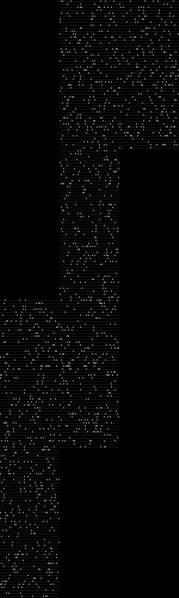

# Advent of Code 2022

All my Advent of Code 2022 attempts! Mainly in Python.

## Cool Stuff

|Day 22 Part 1|Day 22 Part 2|
|---|---|
|||

## Note to Self
```sh
export X=... # day number

# Python
cd Day-$X/Python && python3 main.py < ../$X.in && cd ../..

# JavaScript
cd Day-$X/JavaScript && node main.js < ../$X.in && cd ../..

# Java
cd Day-$X/Java && javac Main.java && java Main < ../$X.in && cd ../..

# C++
cd Day-$X/C++ && g++ -o mainc main.cpp && ./mainc < ../$X.in && cd ../..

# Haskell
cd Day-$X/Haskell && runhaskell main.hs && cd ../..

# Rust
cd Day-$X/Rust && rustc main.rs && ./main < ../$X.in && cd ../..
```
